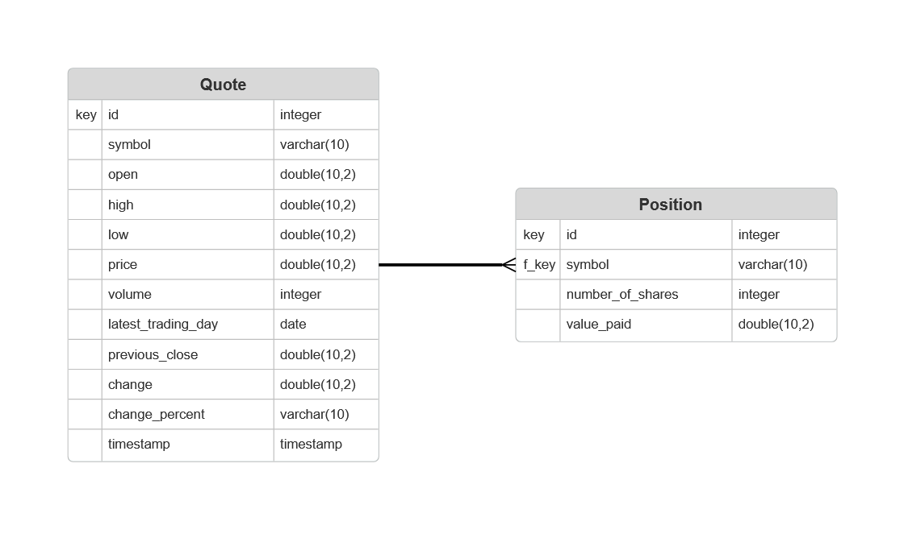

# Introduction
The Stockquote app is a Java tool that enables users to buy and sell stock positions in real-time. The app uses a third-party API that returns stock market data in JSON format, which is then parsed into Java objects for processing. Itleverages modern libraries such as OkHttp for making HTTP requests and Jackson for efficiently parsing JSON data. Requests are stored in a PostgreSQL database running in a Docker container. Most importantly, this project taught me how to properly test my code with Unit and Integration tests.

# Implementaiton
## ER Diagram
  
As you can see in the diagram, each quote can have many positions, with the symbol as the foreign key in the Position table.

## Design Patterns
In the Stockquote app, we used the DAO pattern. A repository pattern could have been implemented, but since our DAO objects are so simple, we really do not have too much to hide in another layer of logic, and it is simpler to manage our very 'anemic' in a single DAO, with our queries right there. 

# Test
The Stockquote app features Unit and Integration tests to ensure seamless use and accuracy. The test starts by connecting to our Database and creating a new object. It then checks if the object exists, by asserting our findById method returns a Quote with the expected symbol. Lastly, the quote is deleted to return our database to where it was before the tests run.
The integration test runs the application top-down. It will fetch a new Quote from the API, parse it into a Java Object, save it in to the database, search for it, then delete it.
