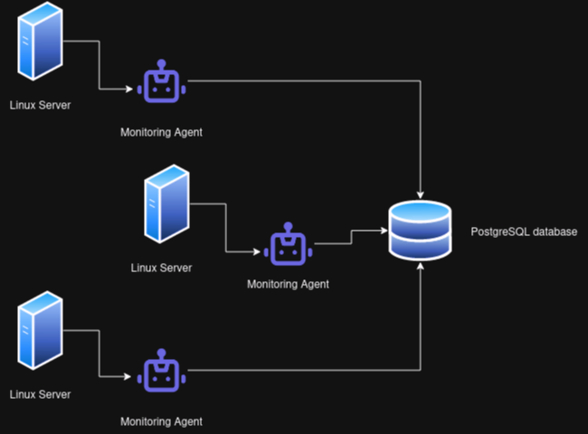

# Introduction
The Linux Cluster Monitoring Agent is a simple yet powerful solution to gathering a host system's hardware information and usage. This product is intended for IT teams who need a way to log and review their systems usage to manage server costs and performance. 

# Quick Start
- Clone the repo
- Start a psql instance using psql_docker.sh
- Create tables using ddl.sql
- Insert hardware specs data into the DB using host_info.sh
- Insert hardware usage data into the DB using host_usage.sh
- Crontab setup

# Implemenation
The Monitoring Agent is implemented in Bash, communicating to a PostgresSQL instance through docker. The project's development history is available via git commits.

## Architecture
  
As shown in the diagram, each node runs an instange of the agent (via a cron job) that communicates with a PostgreSQL database.

## Scripts
Shell script description and usage
- psql_docker.sh > [start|stop|create] > Creates a Docker container with the latest PostgreSQL image
- host_info.sh > host, port, db, username, password > Reads host information such as hostname, architecture, total memory, and inserts a row into the PostgreSQL database
- host_usage.sh > host, port, db, username, password > Reads host information such as hostname, architecture, total memory, and inserts a row into the PostgreSQL database
- crontab > crontab -e 't script-path' > Schedules a cron job to run every 't' seconds
- ddl.sql > Connects to the host_agent database and creates usage and info tables

## Database Modeling
- `host_info`
- Id: Auto-incremented identifier for each row (PK)
- Hostname: A unique field that holds the name of the target machine
- CPU Number: The number of CPU cores present
- CPU Architecture: The CPU architecture (i.e. x86, ARM, RISC V)
- CPU Model: The CPU Model number
- CPU Mhz: The speed in which a CPU can execute instructions 
- L2 Cache: The CPUs cache size in Kilobytes
- Total Memory: The total RAM available in Megabytes
- Timestamp: UTC timestamp when the row was inserted into the PostgreSQL database

- `host_usage`
- Host Id: Foreign key that links each row back to a host stored in host_info (FK)
- Memory Free: The amount of memory free in Megabytes
- CPU Idle: The amount of time spent idle
- CPU Kernel: The amount of time spent running kernel code
- Disk IO: Current IO transfer speeds
- Disk Space Available: Amount of disk space available in Megabytes
- Timestamp: UTC timestamp when the row was inserted into the PostgreSQL database

# Test
DDL scripts were tested by running the scripts and querying the database to see if the expected result was outputted.
All bash scripts were debugged by running bash with the -x flag. Guard clauses are in place to ensure correct arguments are passed.

# Deployment
The agent is deployed via a cron job that stores a usage and info record into the PostgreSQL database every 60 seconds

# Improvements
- Error handling
- Windows compatibility
- UI 
